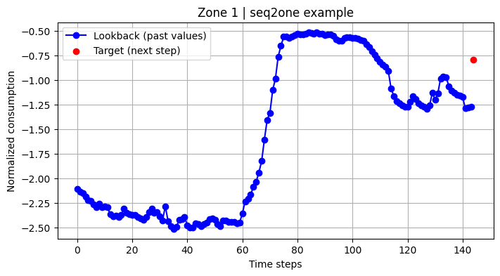
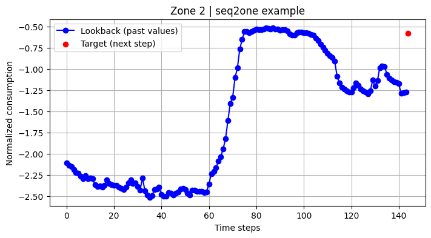
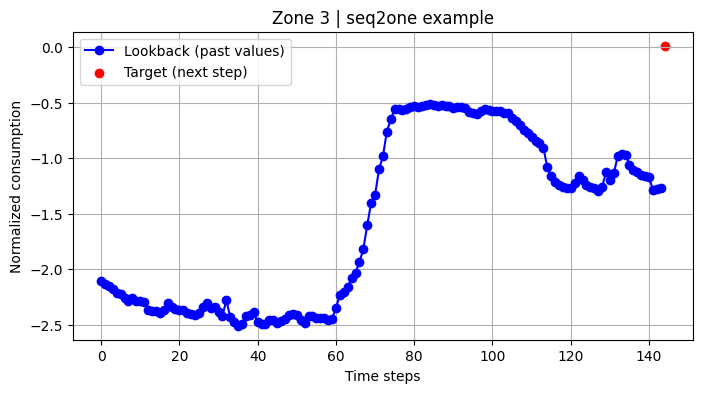

# Time-Series Data Preparation Report

### **1. Objective**

The goal of this stage is to transform raw power consumption data into structured sequences suitable for time-series modeling.

- Creating lookback windows for sequence-to-one (predicting the next step)
- Optional goal - sequence-to-sequence (predicting multiple future steps)
- Normalizing continuous variables
- Engineering cyclical time features (e.g., sine/cosine transforms of hour/day-of-week)
- Preparing the data for deep learning frameworks (PyTorch)

### **2. Feature Engineering**

- Normalization
  - Continuous features are standardized using StandardScaler:
  - Cyclical Time features added:
  ```
  df['hour_sin'] = np.sin(2 * np.pi * df['hour'] / 24)
  df['hour_cos'] = np.cos(2 * np.pi * df['hour'] / 24)
  df['day_sin'] = np.sin(2 * np.pi * df['day_of_week'] / 7)
  df['day_cos'] = np.cos(2 * np.pi * df['day_of_week'] / 7)
  df['month_sin'] = np.sin(2 * np.pi * df['month'] / 12)
  df['month_cos'] = np.cos(2 * np.pi * df['month'] / 12)
  ```

### **3. Lookback Window**

- Time interval: 10 minutes
- lookback: 144 (Last 24 hours)
- predict_next: 6 (next hour)
- Create Seq2One window

**Below are the seq2one plots for all zones**

- Zone 1
  

- Zone 2
  

- Zone 3
  

- Blue Line (x: 0 - 143): Lookback Window (last 24 hours)
- Red Dot (x: 145): the prediction target (t+1)
- Last N (144) steps, predict the very next step N+1 (145).

\*\*Zone 1, 2 & 3" shows very similar past patterns,

- Decline overnight → people asleep, low usage.
- Morning rise → people wake up, appliances kick in.
- Midday stability → steady office/daytime demand.
- Afternoon dip → slight slowdown.
- Evening surge (red point) → beyond what history suggests.
- Looking at past values isn’t enough — the model needs to understand (teach) the cyclical features of the time of day.
- Zone 1: target is: -0.76, higher than the recent trend, indicating a sudden spike in demand.
- Zone 2: target is -0.55, higher than the recent trend, indicating a sudden spike in demand.
- Zone 3: target is 0, showing no significant change from the recent trend.

\*_Zone 3"_

### **4. Chronological Data Split**

- preserve time order to prevent leakage
- split into train, validation and test set

### **6. Conversion to PyTorch Dataset**

- when creating loaders set shuffle=false, ensures chronological order is preserved.
