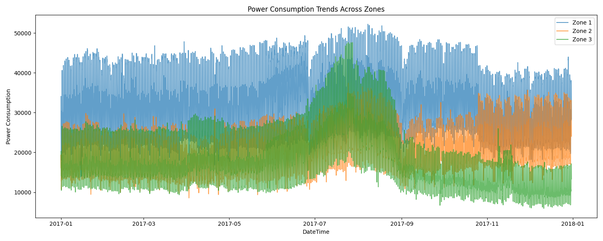
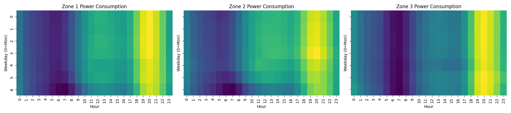
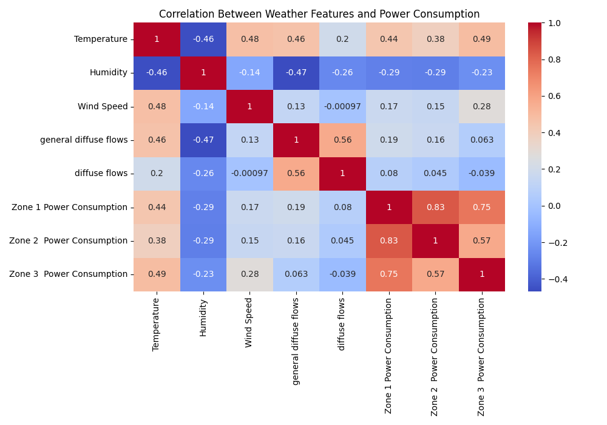
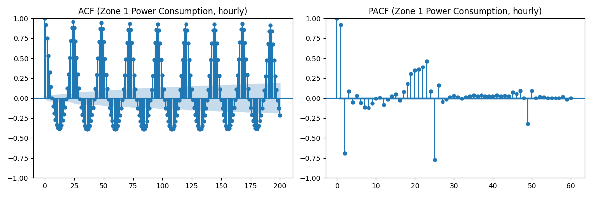
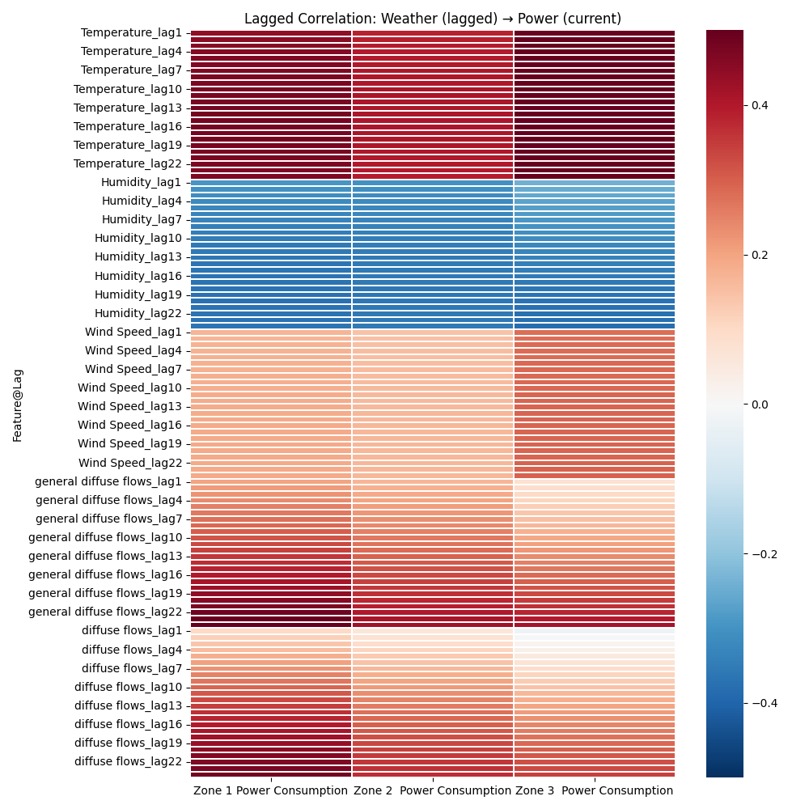

# 🔴 PowerCast – Advanced Track

## ✅ Week 1: Setup & Exploratory Data Analysis (EDA)

---

### 🧭 1. Time Consistency & Structure

Q: Are there any missing or irregular timestamps in the dataset? How did you verify consistency?  
A: No missing or irregular timestamps. Consecutive deltas are 10 minutes; the first row shows `time_diff = NaN` because there is no previous timestamp to compare.

Q: What is the sampling frequency and are all records spaced consistently?  
A: Sampling frequency is 10 minutes, yielding a daily period of approximately 144 steps. Spacing is consistent throughout.

Q: Did you encounter any duplicates or inconsistent `DateTime` entries?  
A: No. Duplicate timestamps = 0; duplicate rows = 0.

---

### 📊 2. Temporal Trends & Seasonality

Q: What daily or weekly patterns are observable in power consumption across the three zones?  
A: Clear hour‑of‑day cycles with evening peaks and overnight troughs across zones. Weekdays generally exhibit higher consumption than weekends.

Q: Are there seasonal or time-of-day peaks and dips in energy usage?  
A: Evening peaks and early‑morning dips are consistently present; STL decomposition of Zone 1 shows a stable daily seasonal component.

Q: Which visualizations helped you uncover these patterns?  
A: Multi‑zone time series, hour‑of‑day and day‑of‑week averages, and Weekday × Hour heatmaps.

More figures:

- [Average by hour](./assets/avg_by_hour.png)
- [Average by day of week](./assets/avg_by_dow.png)
- [STL decomposition (Zone 1)](./assets/zone1_stl.png)

---

### 🌦️ 3. Environmental Feature Relationships

Q: Which environmental variables (temperature, humidity, wind speed, solar radiation) correlate most with energy usage?  
A: Temperature is the strongest positive correlate; example Pearson correlations — Zone 1 ≈ 0.440, Zone 2 ≈ 0.382, Zone 3 ≈ 0.490.

Q: Are any variables inversely correlated with demand in specific zones?  
A: Humidity shows moderate negative correlation across zones (≈ −0.23 to −0.30).

Q: Did your analysis differ across zones? Why might that be?  
A: Magnitudes vary by zone (e.g., stronger temperature association in Zone 3), likely due to differences in load composition and local factors.

---

### 🌀 4. Lag Effects & Time Dependency

Q: Did you observe any lagged effects where past weather conditions predict current power usage?  
A: Yes. Short‑lag temperature effects are most prominent; humidity exhibits weaker inverse effects; wind and radiation are weaker/variable.

Q: How did you analyze lag (e.g., shifting features, plotting lag correlation)?  
A: Created lagged features (1–3 steps at 10‑minute intervals) and computed correlations; plotted ACF/PACF on hourly‑resampled series; produced a weather→power lag heatmap over 1–24 steps with a best‑lag table.

Q: What lag intervals appeared most relevant and why?  
A: Short lags (≤ 3 steps) show highest associations; ACF indicates strong daily periodicity (~24 hourly lags). Proposed lookbacks: 6h, 12h, 24h; horizons: 1h, 2h, 6h (see `assets/phase1_eda_summary.json`).

More figures:

- [ACF/PACF (Zone 2)](./assets/zone_2__power_consumption_acf_pacf.png)
- [ACF/PACF (Zone 3)](./assets/zone_3__power_consumption_acf_pacf.png)

---

### ⚠️ 5. Data Quality & Sensor Anomalies

Q: Did you detect any outliers in the weather or consumption readings?  
A: Yes. |z| > 3 counts — Zone 1 = 0, Zone 2 = 1, Zone 3 = 653, Temperature = 89, Humidity = 209, Wind Speed = 0, General diffuse flows = 23, Diffuse flows = 1361.

Q: How did you identify and treat these anomalies?  
A: Identified using z‑scores; no treatment applied in Phase 1.

Q: What might be the impact of retaining or removing them in your model?  
A: Retention preserves rare events but may affect outlier‑sensitive models; capping or filtering can stabilize training at the risk of information loss.

---

## 🛠️ Week 2: Feature Engineering & Deep Learning Preparation

### 🔄 1. Sequence Construction & Lookback Windows

Q: How did you determine the optimal lookback window size for your sequence models?  
A: From Week 1 lag analysis and ACF/PACF. Strong daily cycle (144 steps) plus shorter windows (36, 72) for near-term effects. Horizons set at 6, 12, 36 steps (1–6 h ahead).

Q: What challenges did you face when converting the time-series data into input/output sequences?  
A: Ensuring correct alignment between last input step and first target step, handling multi-zone outputs, and managing large memory when generating all lookback/horizon pairs.

Q: How did you handle cases where the lookback window extended beyond the available data?  
A: Computed n_samples = len − lookback − horizon + 1 and discarded invalid windows.

---

### ⚖️ 2. Feature Scaling & Transformation

Q: Which normalization or standardization techniques did you apply to the features, and why?  
A: StandardScaler (zero-mean, unit-variance) for all numeric features; improves training stability across variables with different scales.

Q: Did you engineer any cyclical time features (e.g., sine/cosine transforms for hour or day)? How did these impact model performance?  
A: Yes. Added hour-sin/cos and weekday-sin/cos. They capture cyclic behavior without discontinuities and improved validation loss.

Q: How did you address potential data leakage during scaling or transformation?  
A: Scalers fit on training split only and applied to validation/test. Targets left unscaled (or scaled separately when required).

---

### 🧩 3. Data Splitting & Preparation

Q: How did you split your data into training, validation, and test sets to ensure temporal integrity?  
A: Chronological split: 70% train, 15% validation, 15% test.

Q: What considerations did you make to prevent information leakage between splits?  
A: No shuffling; windows generated after splitting; scalers fit on train only.

Q: How did you format your data for use with PyTorch DataLoader or TensorFlow tf.data.Dataset?  
A: Converted arrays to tensors (X: [N, lookback, features], y: [N, horizon, targets]) and wrapped in TensorDataset + DataLoader with batch size 64.

---

### 📈 4. Feature-Target Alignment

Q: How did you align your input features and target variables for sequence-to-one or sequence-to-sequence forecasting?  
A: Defined X = values[i:i+lookback], y = values[i+lookback:i+lookback+horizon] with target indices. Ensures last input step directly precedes first target step.

Q: Did you encounter any issues with misalignment or shifting of targets? How did you resolve them?  
A: Initial off-by-one risks handled with assertions and timestamp checks (max(X_time) = min(y_time) − 1 step).

---

### 🧪 5. Data Quality & Preprocessing

Q: What preprocessing steps did you apply to handle missing values or anomalies before modeling?  
A: Verified DateTime ordering and 10-min frequency; removed duplicates (none found); flagged outliers via z-score but did not cap/clip.

Q: How did you verify that your data pipeline produces consistent and reliable outputs for model training?  
A: Checked deterministic sample counts, validated shapes/dtypes, logged window shapes for each (lookback, horizon), and reloaded saved .npy/scaler artifacts for consistency.
