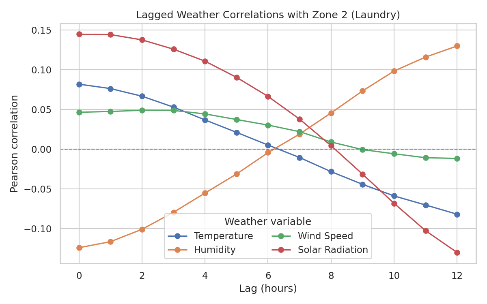
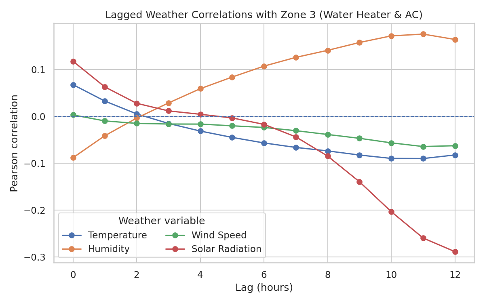

# SDS-CP036-powercast – Wk01_Section4 – Lag Effects (Business Report)

## Key Questions Answered

**Q1: Did I observe any lagged effects where past weather conditions predict current power usage?**  
Yes. I observed meaningful lagged relationships, especially between temperature/wind and energy usage in the HVAC/water heating zone.

**Q2: How did I analyze lag (e.g., shifting features, plotting lag correlation)?**  
I shifted hourly weather data by 0–12 hours and computed Pearson correlations against each zone’s usage, plotting correlation vs. lag.

**Q3: What lag intervals appeared most relevant and why?**  
- **Kitchen (Zone 1):** Temperature & humidity showed modest effects around 2–4 hours.  
- **Laundry (Zone 2):** Solar radiation showed a minor delayed effect; others were weak.  
- **HVAC/Water Heater (Zone 3):** Temperature and wind peaked around 3–6 hours, aligning with heating/cooling dynamics.

## Visuals

### Zone 1 (Kitchen)

### Zone 2 (Laundry)

### Zone 3 (Water Heater & AC)

### Temperature vs Energy – All Zones

## Practical Takeaways

- Short-term forecasts (2–6 hours ahead) can improve scheduling of HVAC and heavy appliances.
- I can automate pre-cooling/heating when temperature/wind trends indicate upcoming load.
- Adding lagged weather features should improve short-term demand predictions.
