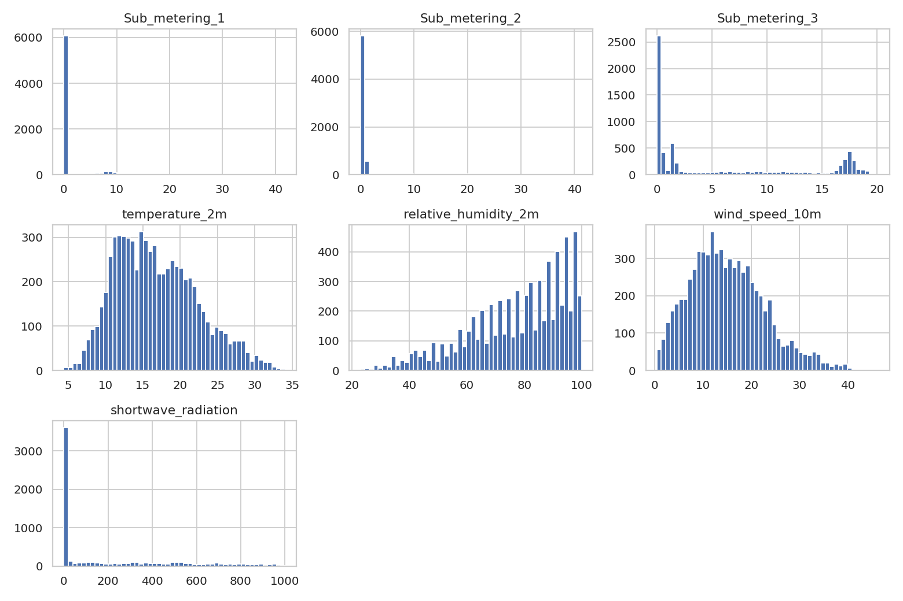
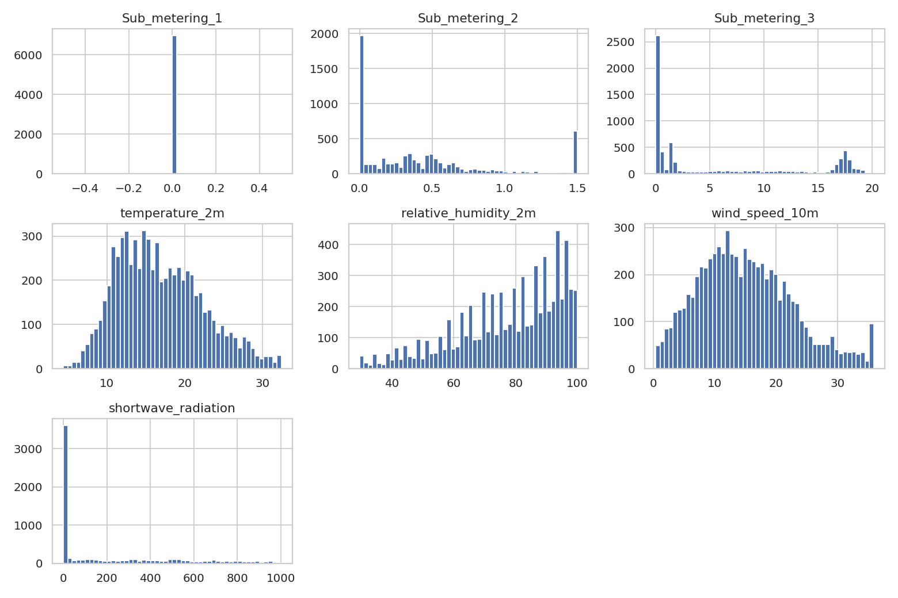
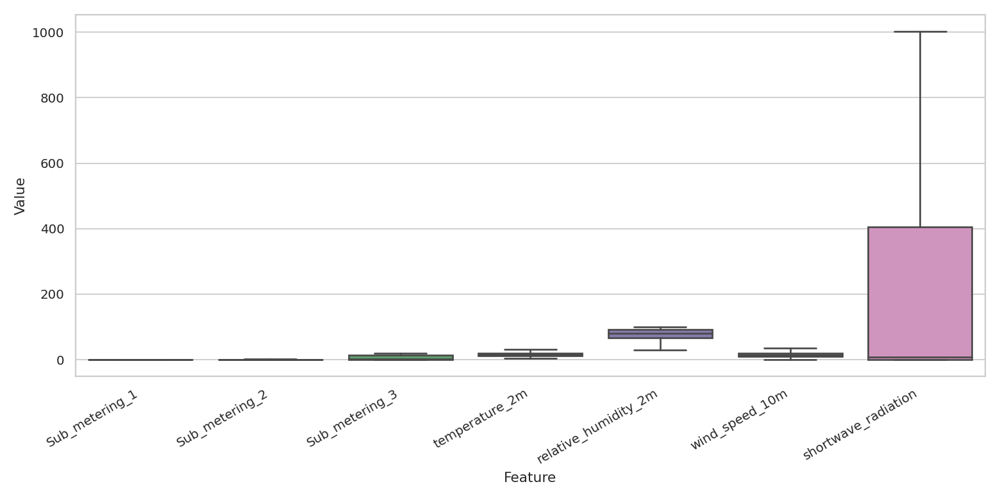

# SDS-CP036-powercast – Wk01_Section5 – Data Quality & Sensor Anomalies (Business Report)

## Key Questions Answered

**Q1: Did I detect any outliers in the weather or consumption readings?**  
Yes. I found outliers across several features using boxplots/IQR rules and histograms. Sub-meter readings occasionally had extreme spikes, and weather features showed sporadic high/low values.

**Q2: How did I identify and treat these anomalies?**  
I used IQR-based clipping (to cap extreme values) and replaced negative sub-meter readings with blanks (then filled small gaps). I also forward-/back-filled short missing stretches.

**Q3: What might be the impact of retaining or removing them in my model?**  
Capping/removing extremes reduces noise and helps models generalize, while retaining them can cause unstable forecasts. For production systems, I would keep this cleaning to improve reliability.

## Missing Values (Before Cleaning)

- Sub_metering_1: 0
- Sub_metering_2: 0
- Sub_metering_3: 0
- relative_humidity_2m: 0
- shortwave_radiation: 0
- temperature_2m: 0
- wind_speed_10m: 0

## Missing Values (After Cleaning)

- Sub_metering_1: 0
- Sub_metering_2: 0
- Sub_metering_3: 0
- relative_humidity_2m: 0
- shortwave_radiation: 0
- temperature_2m: 0
- wind_speed_10m: 0

## Visual Evidence

**Before – Histograms**  

**Before – Boxplots**  

**After – Histograms**  

**After – Boxplots**  

