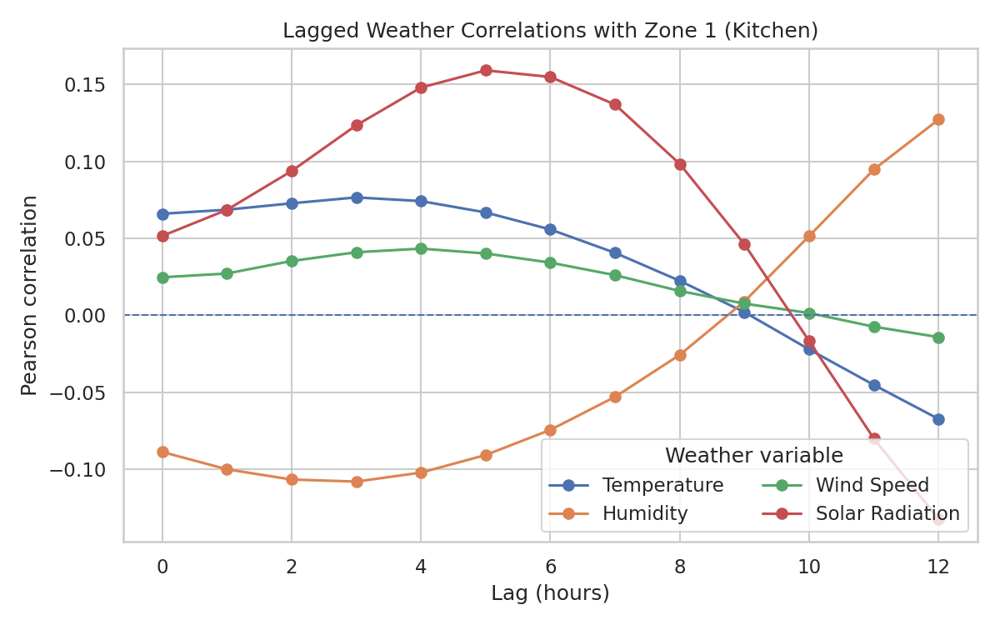

# kgirishv — Powercast (Beginner Track)

**Team member:** [@kgirishv](https://github.com/kgirishv)

> This folder contains my Week 1 business report and generated plots. Click any link below to open the image on GitHub.

## Short Bio
Oracle SCM Cloud consultant and AI/ML practitioner. Building practical forecasting and analytics workflows for the Powercast project.

## How to Reproduce the Plots
- Clone my working repository with code/notebooks:  
  \git clone https://github.com/kgirishv/Powercast.git\
- Set up Python (3.10+) and install dependencies (see that repo’s README or \
equirements.txt\ if present).
- Make sure data files are available (e.g., \power_consumption.csv\, \weather_data/weather_2006_2010.csv\).
- Run the Week 1 notebooks/scripts as described in the **Powercast** repo.  
  Rendered reports and figures are exported to this folder under \
esults/\ for easy review.

### Quick Gallery (click any thumbnail)

### All Plot Files (click to open)
- [SDS-CP036-powercast_Wk01_Section2_Plot_Daily_Line](./results/Wk01_Section2/plots/SDS-CP036-powercast_Wk01_Section2_Plot_Daily_Line.png)
- [SDS-CP036-powercast_Wk01_Section2_Plot_Heatmap_Zone1](./results/Wk01_Section2/plots/SDS-CP036-powercast_Wk01_Section2_Plot_Heatmap_Zone1.png)
- [SDS-CP036-powercast_Wk01_Section2_Plot_Weekly_Box](./results/Wk01_Section2/plots/SDS-CP036-powercast_Wk01_Section2_Plot_Weekly_Box.png)
- [SDS-CP036-powercast_Wk01_Section3_Plot_Corr_AllZones](./results/Wk01_Section3/plots/SDS-CP036-powercast_Wk01_Section3_Plot_Corr_AllZones.png)
- [SDS-CP036-powercast_Wk01_Section4_lagcorr_Sub_metering_1](./results/Wk01_Section4/plots/SDS-CP036-powercast_Wk01_Section4_lagcorr_Sub_metering_1.png)
- [SDS-CP036-powercast_Wk01_Section4_lagcorr_Sub_metering_2](./results/Wk01_Section4/plots/SDS-CP036-powercast_Wk01_Section4_lagcorr_Sub_metering_2.png)
- [SDS-CP036-powercast_Wk01_Section4_lagcorr_Sub_metering_3](./results/Wk01_Section4/plots/SDS-CP036-powercast_Wk01_Section4_lagcorr_Sub_metering_3.png)
- [SDS-CP036-powercast_Wk01_Section4_lagcorr_temperature_all_zones](./results/Wk01_Section4/plots/SDS-CP036-powercast_Wk01_Section4_lagcorr_temperature_all_zones.png)
- [SDS-CP036-powercast_Wk01_Section5_Plot_Box_After](./results/Wk01_Section5/plots/SDS-CP036-powercast_Wk01_Section5_Plot_Box_After.png)
- [SDS-CP036-powercast_Wk01_Section5_Plot_Box_Before](./results/Wk01_Section5/plots/SDS-CP036-powercast_Wk01_Section5_Plot_Box_Before.png)
- [SDS-CP036-powercast_Wk01_Section5_Plot_Hist_After](./results/Wk01_Section5/plots/SDS-CP036-powercast_Wk01_Section5_Plot_Hist_After.png)
- [SDS-CP036-powercast_Wk01_Section5_Plot_Hist_Before](./results/Wk01_Section5/plots/SDS-CP036-powercast_Wk01_Section5_Plot_Hist_Before.png)
